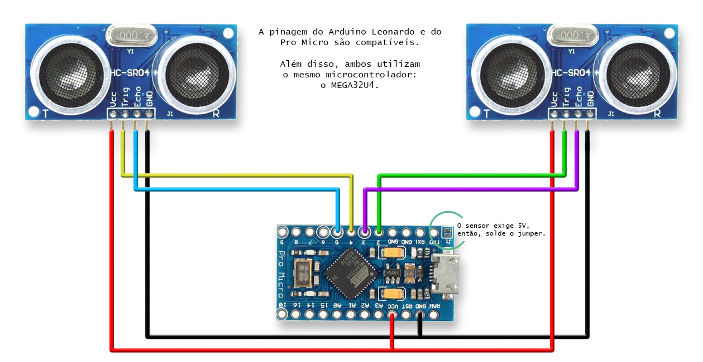

# HID_Ultrasonico_Diferencial

Este é um controle de ponteiro do Mouse no eixo X, utilizando um Arduino Leonardo e dois sensores ultrassônicos de distância em modo diferencial.
Assim, tanto a direção quanto a velocidade do ponteiro são calculadas pela diferença da distância entre dois obstáculos, por exemplo duas mãos.
Ou seja, se as duas mãos estiverem à mesma distância dos sensores, não há movimento. Caso haja uma diferença, o cursor se move para o mais próximo e quanto maior a diferença maior será a velocidade do ponteiro.

As placas de controle baseadas no chip MEGA32U4 apresentam a posibilidade de serem programadas como dispositivos USB do tipo HID (Human Interface Device). São dispositivos que servem como interface humano-máquina, tais como mouse, teclado, joystics, touchpads, etc. Assim, ligando potenciômetros, botões, sensores de toque, dentre outros, essas placas podemo atuar como essas interfaces ou emular suas características (como é o caso deste projeto).

Aqui, vemos como é feita a ligação dos sensores a um Arduino Pro Micro (para um Arduino Leonardo, manter a mesma pinagem):

